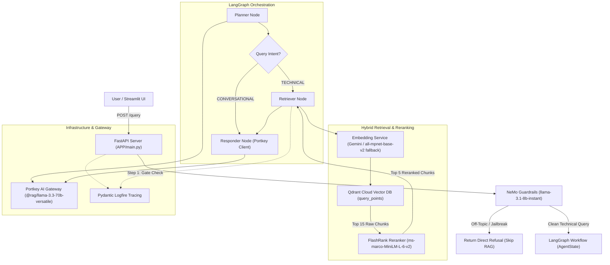

# Enterprise Agentic RAG System

I built this project to tackle a common problem in production RAG systems: dealing with noisy document collections (like enterprise Kubernetes guides, Intel hardware datasheets, and networking docs) without wasting LLM calls on off-topic questions or falling prey to prompt injection attempts.

Instead of building a simple single-prompt RAG wrapper, I designed a multi-layer pipeline: a fast intent & guardrail gate at the front, a LangGraph state machine with thread memory, a dual-model embedding system with automatic local fallback, vector search in Qdrant, and local cross-encoder reranking via FlashRank.

---

## Architecture Overview

Here is how a request moves through the system from the frontend or API down to retrieval, reranking, and generation:



---

## Technical Breakdown

### 1. Guardrails Gate (`APP/Guardrails/`)
Before any request touches the expensive RAG graph or vector store, it passes through an NVIDIA NeMo Guardrails layer initialized in `rails.py` using `llama-3.1-8b-instant` via Groq. 

I wrote custom Colang rules (`colang_rules.py`) to handle four distinct categories:
- **Jailbreak Protection**: Intercepts prompt overrides ("ignore previous instructions", "DAN mode", "developer mode").
- **Off-Topic Filtering**: Blocks generic non-technical requests (jokes, math homework, recipes) with a standard refusal.
- **System Capabilities & Greetings**: Responds to greetings and capability inquiries directly at the gate.

If a rail fires, the request exits early with a `200 OK` response containing `status: "Blocked by guardrails."` and skips document retrieval entirely.

### 2. LangGraph Agent & Memory (`APP/agents/`)
The agent execution graph is orchestrated using `LangGraph` with state defined in `AgentState` (`state.py`). Conversation state across queries is preserved using LangGraph's `MemorySaver` checkpointer, keyed by `thread_id`.

- **Planner Node (`nodes/planner.py`)**: Analyzes conversation history alongside the latest prompt. If the user is making casual conversation or asking something answerable from existing history, it flags the intent as `CONVERSATIONAL`. Otherwise, it extracts a refined search query.
- **Conditional Routing (`graph.py`)**: Routes `CONVERSATIONAL` intent straight to the responder node, bypassing vector search.
- **Retriever Node (`nodes/retrival.py`)**: Queries Qdrant for candidates and passes them through FlashRank semantic reranking.
- **Responder Node (`nodes/responder.py`)**: Synthesizes the final answer using the native Portkey client, packing formatted context up to 25,000 characters.

### 3. Dual Embedding Strategy & Qdrant Integration (`APP/Services/Retrival/`)
One challenge I hit early on was embedding API rate limits and dimension mismatches in vector search:
- **Primary Embedding**: Probes Google's `models/gemini-embedding-2-preview` (`3072` dimensions) with automatic retry logic (up to 4 attempts with exponential backoff on 429 errors).
- **Local Fallback**: If Gemini fails or hits quota limits, the system automatically falls back to a local `SentenceTransformer("all-mpnet-base-v2")` (`768` dimensions).
- **Batch Processing**: Text chunks are embedded in batches of 50 (`BATCH_SIZE = 50`) wrapped in Logfire spans for performance monitoring.
- **Vector Database**: Connects to Qdrant Cloud using the modern `client.query_points()` interface. The collection dimension is dynamically set on creation based on whichever embedding model initialized successfully.

### 4. Semantic Reranking with FlashRank (`APP/Services/Retrival/ranking_service.py`)
Standard vector search (cosine similarity) can bring back noisy candidates when querying large text blocks. To solve this without adding heavy cloud latency, I integrated `FlashRank`, a lightweight local cross-encoder using the ONNX-quantized `ms-marco-MiniLM-L-6-v2` model.

The retriever pulls 15 candidate chunks from Qdrant and passes them to FlashRank. FlashRank re-scores them semantically and returns only the top 5 most relevant passages for context synthesis. If the local cross-encoder fails for any reason, the system safely falls back to the top raw Qdrant results.

### 5. Portkey AI Gateway Proxy (`APP/Gateway/client.py`)
To manage LLM calls, fallbacks, and caching, I routed requests through Portkey AI Gateway:
- **Proxy Client**: Since LangChain's native `ChatGroq` client does not allow custom proxy URL overrides, I used `ChatOpenAI` configured with Portkey's gateway URL (`PORTKEY_GATEWAY_URL`) and headers. This allows targeting Groq models via Portkey slugs (`@rag/llama-3.3-70b-versatile`).
- **Cache Header Extraction**: The responder node uses the native `portkey_client` to read the `x-portkey-cache-status` HTTP response header. When a cache hit occurs, it appends `"Cache: Hit ⚡"` to the thought process log and surfaces it in the UI.

### 6. Universal Ingestion Pipeline (`APP/Ingestion/`)
The ingestion engine (`processor.py`) ingests heterogeneous document collections:
- **PDFs**: Parsed via `pypdf` with automatic page-level fallback to `pdfplumber` for text extraction on image-heavy or complex layouts (`loaders/pdf.py`).
- **HTML**: Cleaned using `BeautifulSoup` to strip `<script>`, `<style>`, and metadata tags while normalizing whitespace (`loaders/html.py`).
- **Office Docs**: `.docx` and `.pptx` files parsed using `unstructured.partition.auto` (`loaders/office.py`).
- **Chunking**: Text is split into ~1500 character chunks using paragraph boundaries (`Chunking/splitter.py`).
- **Local Persistence**: Extracted text and metadata are saved as local JSON snapshots in `processed_data/` before vectorizing into Qdrant.

### 7. Observability & Tracing
Every major operation in the application is wrapped with `Pydantic Logfire` spans (`logfire.span`). This provides visibility into:
- Ingestion batch progress and timing.
- Guardrail check evaluations and latency.
- Qdrant vector search candidate counts.
- FlashRank cross-encoder execution duration and top semantic scores.
- FastAPI request lifecycle and error tracebacks.

---

## Directory Structure

```
.
├── APP/
│   ├── Gateway/
│   │   └── client.py             # Portkey AI gateway integration & cache extractor
│   ├── Guardrails/
│   │   ├── colang_rules.py       # Colang intent rules, flows & indicator phrases
│   │   └── rails.py              # NeMo Guardrails singleton (llama-3.1-8b-instant)
│   ├── Ingestion/
│   │   ├── Chunking/
│   │   │   └── splitter.py       # Paragraph-based text chunker (1500 chars)
│   │   ├── loaders/
│   │   │   ├── html.py           # BeautifulSoup HTML parser
│   │   │   ├── office.py         # Unstructured DOCX/PPTX parser
│   │   │   ├── pdf.py            # pypdf parser with pdfplumber fallback
│   │   │   └── text.py           # Plain text parser
│   │   └── processor.py          # Universal ingestion pipeline & CLI
│   ├── Services/
│   │   └── Retrival/
│   │       ├── embeddings.py     # Gemini embedding engine with sentence-transformer fallback
│   │       ├── qdrant_service.py # Qdrant vector search interface (query_points)
│   │       └── ranking_service.py# FlashRank local cross-encoder reranker
│   ├── agents/
│   │   ├── nodes/
│   │   │   ├── planner.py        # Query intent planner node
│   │   │   ├── responder.py      # LLM context synthesis node
│   │   │   └── retrival.py       # Vector search + rerank node
│   │   ├── graph.py              # LangGraph StateGraph & MemorySaver definition
│   │   └── state.py              # AgentState TypedDict schema
│   ├── config.py                 # Pydantic/dotenv configuration settings
│   └── main.py                   # FastAPI application & /query, /graph endpoints
├── DATA/                         # Source documents (true_data & noisy_data)
├── evals/
│   ├── app.py                    # Streamlit evaluation suite dashboard
│   ├── data_parser.py            # Document parser for evaluation datasets
│   ├── golden_dataset.json       # Ground truth Q&A pairs and guardrail test cases
│   └── guardrails_eval.py        # Guardrails precision/recall/accuracy benchmark
├── processed_data/               # Local JSON snapshots of parsed document chunks
├── ui/
│   └── app.py                    # Streamlit chat interface
├── .env                          # API keys and system configuration
├── PROJECT_LOG.md                # Development milestone log
└── requirements.txt              # Project dependencies
```

---

## Setup & Running Locally

### 1. Environment Configuration
Create a `.env` file in the root directory with your API keys:

```env
GROQ_API_KEY=your_groq_api_key
GROQ_FALLBACK_API_KEY=your_secondary_groq_key
QDRANT_API_KEY=your_qdrant_api_key
QDRANT_CLUSTER_ENDPOINT=https://your-cluster.qdrant.io:6333
GEMINI_API_KEY=your_gemini_api_key
PORTKEY_API_KEY=your_portkey_api_key
LOGFIRE_TOKEN=your_logfire_token
```

### 2. Installation
Install the required Python dependencies:

```bash
pip install -r requirements.txt
```

### 3. Ingestion Pipeline
To ingest documents from the `DATA/` directory into Qdrant:

```bash
# Ingest DATA directory
python -m APP.Ingestion.processor DATA

# Wipe collection and re-ingest fresh
python -m APP.Ingestion.processor DATA --wipe
```

### 4. Run FastAPI Backend
Start the backend server on port 8000:

```bash
uvicorn APP.main:app --reload --port 8000
```

Available API Endpoints:
- `GET /`: Health check.
- `GET /graph`: Returns the compiled LangGraph workflow visualizer as PNG.
- `POST /query`: Processes queries through Guardrails + LangGraph RAG pipeline.

Sample `/query` payload:
```json
{
  "q": "How do I configure SRIOV network attachments in Kubernetes?",
  "thread_id": "user_session_123"
}
```

### 5. Launch User Interface
In a separate terminal, start the Streamlit chat app:

```bash
streamlit run ui/app.py
```

### 6. Run Evaluation Suite (Optional)
To review ground truth datasets and test guardrail precision/recall:

```bash
streamlit run evals/app.py
```

---

## Current Status & Known Limitations

- **Evaluation Metrics**: Ground truth data parsing and guardrail precision/recall benchmarking are functional in `evals/guardrails_eval.py` and `evals/app.py`. Automated RAGAS metric calculations in `evals/metrics.py` and batch pipeline processing in `evals/pipeline.py` are currently unpopulated stubs.
- **Embedding Fallback Path**: In `APP/Services/Retrival/embeddings.py`, `_probe_gemini()` has been configured during local development to route embedding calls to the SentenceTransformer fallback path to ensure stable offline testing without hitting Gemini API quotas.
- **Deployment Manifests**: Containerization files (Dockerfile / Helm charts / Kubernetes manifests) are planned for the next deployment phase.

---

## License

MIT License
